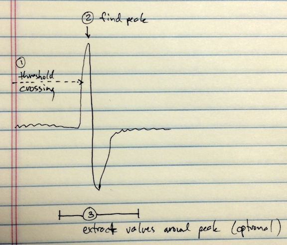

## quickspikes

[](https://doi.org/10.5281/zenodo.1246809)

This is a very basic but very fast window discriminator for detecting and
extracting spikes in a time series. It was developed for analyzing extracellular
neural recordings, but also works with intracellular data and probably many
other kinds of time series.

Here's how it works:



The algorithm iterates through the time series. When the signal crosses the threshold (1) going away from zero, the algorithm then looks for a peak (2) that occurs within some number of samples from the threshold crossing. The number of samples can be adjusted to filter out broad spikes that are likely to be artifacts. If a peak occurs, its sample index is added to an array. These times can be used as-is, or they can be used to extract samples to either side of the peak for further analysis (e.g. spike sorting).

The algorithm uses a streaming pattern (i.e., it processes chunks of data and keeps its state between chunks), so it's suitable for realtime operations. Many signals of interest will require highpass filtering to remove slow variations.

### Installation and Use

The algorithm is written in cython. You can get a python package from PyPI:

    pip install quickspikes

Or to build from a copy of the repository:

    pip install .

To detect peaks, you instantiate the detector with parameters that match the events you want to detect, and then send the detector chunks of data. For example, an extracellular recording at 20 kHz stored in 16-bit integers may have a noise floor around 2000, and the spikes will be on the order of 20 samples wide:

```python
import quickspikes as qs
det = qs.detector(1000, 30)
times = det.send(samples)
```

You can continue sending chunks of data by calling `send()`. The detector will keep its state between calls, so you can detect spikes that occur on chunk boundaries. For example, if you're receiving data from some kind of generator, you could use a pattern like this:

``` python
for chunk in my_data_generator():
    times = det.send(chunk)
    # process times
```

Conversely, if the data are not contiguous, you should reinitialize the detector for each chunk.

You can adjust the detector's threshold at any point, for example to compensate for shifts in the mean and standard deviation of the signal:

```python
reldet = qs.detector(2.5, 30)
reldet.scale_thresh(samples.mean(), samples.std())
times = reldet.send(samples)
```

To detect negative-going events, you'll need to invert the signal.

There are also some functions you can use to extract and align spike waveforms. Given a list of times returned from the `detector.send()` method, to extract waveforms starting 30 samples before the peak and ending 270 samples after:

```python
f_times = qs.filter_times(times, 30, samples.size - 270)
spikes = qs.peaks(samples, f_times, 30, 270)
times, aligned = qs.realign_spikes(f_times, spikes, upsample=3, jitter=4)
```

Note that the list of event times may need to be filtered to avoid trying to access data points outside the bounds of the input time series. If you care about these events, you'll need to pad your input signal. The `realign_spikes` function uses a sinc-based resampling to more accurately locate the peak of the event.

There is also a reference copy of an ANSI C implementation and an `f2py` wrapper in `f2py/`. This algorithm is slightly less efficient and flexible, but may give better results if included directly in a C codebase.

### License

Free for use under the terms of the GNU General Public License. See [[COPYING]]
for details.

If you use this code in an academic work, citations are appreciated. There is no methods paper describing the algorithm, but the most relevant reference is:

C. D. Meliza and D. Margoliash (2012). Emergence of selectivity and tolerance in the avian auditory cortex. Journal of Neuroscience, doi:10.1523/JNEUROSCI.0845-12.2012
